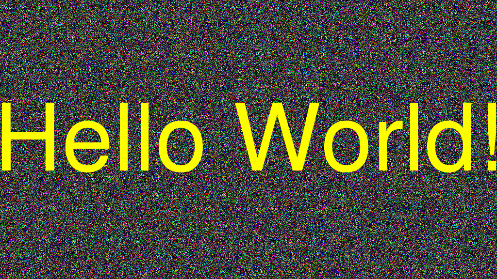

# Hello World

This is my home page! My name is Donovan Jabido and I am a student at [Cal State Fullerton](http://www.fullerton.edu/) and my major is Computer Science.

## Computer Science Projects

My GitHub page is http://github.com/Donj04.

### CPSC 120

* Lab 8

    Lab 8, part 3 was my favorite because it was fun seeing the animations
    our program played. I also learned how to implement a set frame rate,
    which I always wondered about since different computers run at varying
    speeds. It also introduced me to ASCII art which seemed very interesting.

* Lab 11

    Lab 11, part 2 was a favorite because we got to write code that used a
    random number generator. I got to learn how random number generators
    worked and how they evolved. I also got to make an actual hi/lo game that
    implemented unpredictability.

* Lab 12

    I enjoyed Lab 12, part 2 because I was able to create my own GIFs. It
    taught me about how GIFs work and how to make them. I also learned how to
    make random noise with colors to make a colorful background.

